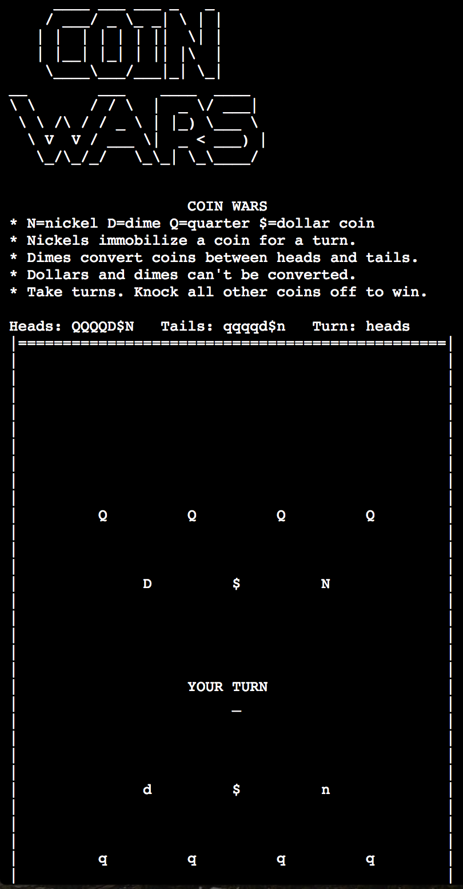

# COIN WARS
## Installation
Install requirements and run python on the coinwars directory at repo root
level beside README.md.

* `pip3 install -r requirements.txt`
* `python3 coinwars/`

## Known Bugs
Sorry, the app crashes if the terminal window is not big enough or
when the window is resized. 

* `_curses.error: addwstr() returned ERR` occurs when you start a game and
  there's not enough room. Decrease your terminal text size or make your window
  bigger to make room for what the game expects!
* `_curses.error: no input` occurs when you resize the window.

## Summary
Here's a fun text-based version of a game called Coin Wars. Coin Wars
is a physical, tactile, turn-based, strategy game. That's to say: players
take turns flicking coins trying to knock their opponent's pieces off a
table. There's two teams: heads and tails. The last player with coins still on
the table wins.

To spice things up, different coins have special abilities. Dimes are light,
easy to knock around, and don't pack much of a punch when they're trying to
push other coins off the table. However! Dimes convert other coins. If a
dime is flicked and hits another coin then that coin is flipped, like flipped
from heads to tails. A player can flick one dime to tap two enemy quarters
and flip them so they're on the dime's team now.

* Read the rules! [coinwars.org](http://coinwars.org/)
* [coinwars.org/ascii](http://coinwars.org/ascii)

